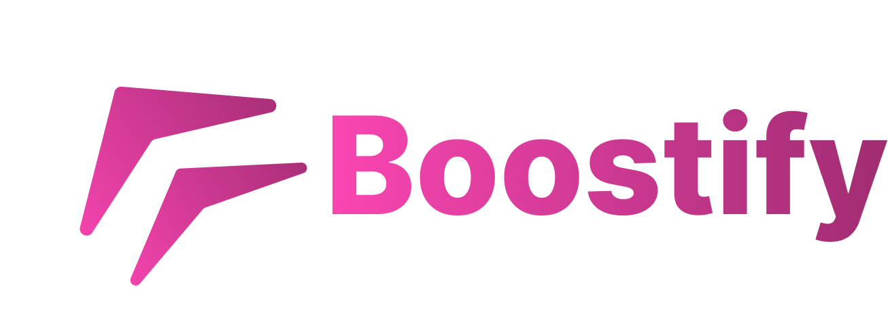

<div align="center">
  

  # Team Boostify

  ### The modern open-source platform for Discord boost management.

  <p>
    Automate boost claims, rewards, tracking, and server management — built for communities that want speed, reliability, and simplicity.
  </p>

  <p>
    <a href="https://discord.gg/vZgeWhZ9aF">
      
    </a>
    <a href="https://github.com/teamboostify/boostify">
      
    </a>
    <a href="https://github.com/teamboostify/boostify/blob/main/LICENSE">
      
    </a>
  </p>
</div>

---

## ✨ About Us

We are **Team Boostify** — a small group of developers passionate about building powerful tools for Discord communities.

Our main project, [**Boostify**](https://github.com/teamboostify/boostify), is an open-source Discord boost management platform designed to automate and simplify the entire boosting experience.

Whether you're managing a small community or a large-scale server, Boostify helps you handle:

- 🚀 Boost claims & reward systems
- 📊 Boost tracking & analytics
- 🔄 Automated workflows
- 🛡️ Secure and scalable infrastructure
- ⚡ Modern developer-friendly architecture

<div align="center">
  
  
</div>

---

## 🌍 Open Source & Community Driven

Boostify is built with the community, not just for the community.

We welcome:
- 🐛 Bug reports
- 💡 Feature suggestions
- 🔧 Pull requests
- ❤️ Contributors of all skill levels

If you want to help shape the future of Boostify, come join us.

---

## 🤝 Get Involved

<div align="center">

| Community | Links |
|---|---|
| 💬 Discord | [Join the Community](https://discord.gg/vZgeWhZ9aF) |
| 🐛 Issues | [Report a Bug](https://github.com/teamboostify/boostify/issues) |
| ⚡ Pull Requests | [Contribute on GitHub](https://github.com/teamboostify/boostify/pulls) |
| 📦 Repository | [View Boostify](https://github.com/teamboostify/boostify) |

</div>

---

## 💻 Tech Stack

```txt
TypeScript • Node.js • Discord.js • PostgreSQL • Prisma • Next.js
```
